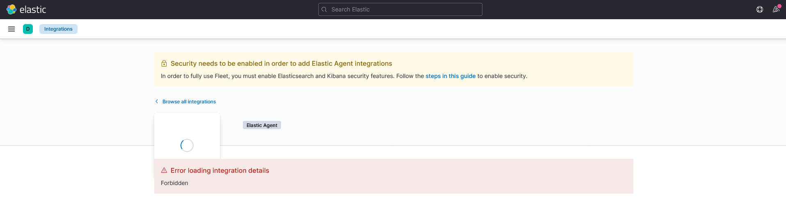

# Local stack with Elastic APM

```shell
# Start stack
docker-compose up -d
# Get logs of APM server
docker logs elastic-apm_apm_1
```

Elastic APM logs in this current setup:
```
[...]
{"log.level":"info","@timestamp":"2022-04-11T14:22:36.740Z","log.logger":"beater","log.origin":{"file.name":"beater/server.go","file.line":233},"message":"Starting apm-server [7814d524d3602e70b703539c57568cba6964fc20 built 2022-03-29 21:27:59 +0000 UTC]. Hit CTRL-C to stop it.","service.name":"apm-server","ecs.version":"1.6.0"}
{"log.level":"info","@timestamp":"2022-04-11T14:22:36.740Z","log.logger":"kibana","log.origin":{"file.name":"kibana/client.go","file.line":182},"message":"Kibana url: http://kibana:5601","service.name":"apm-server","ecs.version":"1.6.0"}
{"log.level":"info","@timestamp":"2022-04-11T14:22:36.742Z","log.logger":"beater","log.origin":{"file.name":"beater/http.go","file.line":96},"message":"RUM endpoints disabled.","service.name":"apm-server","ecs.version":"1.6.0"}
{"log.level":"info","@timestamp":"2022-04-11T14:22:36.743Z","log.logger":"beater","log.origin":{"file.name":"beater/http.go","file.line":106},"message":"SSL disabled.","service.name":"apm-server","ecs.version":"1.6.0"}
{"log.level":"info","@timestamp":"2022-04-11T14:22:36.745Z","log.logger":"kibana","log.origin":{"file.name":"kibana/connecting_client.go","file.line":83},"message":"Successfully obtained connection to Kibana.","service.name":"apm-server","ecs.version":"1.6.0"}
{"log.level":"info","@timestamp":"2022-04-11T14:22:36.764Z","log.logger":"kibana","log.origin":{"file.name":"kibana/connecting_client.go","file.line":83},"message":"Successfully obtained connection to Kibana.","service.name":"apm-server","ecs.version":"1.6.0"}
{"log.level":"error","@timestamp":"2022-04-11T14:22:36.780Z","log.logger":"beater","log.origin":{"file.name":"beater/waitready.go","file.line":62},"message":"precondition 'apm integration installed' failed: error querying Elasticsearch for integration index templates: unexpected HTTP status: 404 Not Found ({\"error\":{\"root_cause\":[{\"type\":\"resource_not_found_exception\",\"reason\":\"index template matching [logs-apm.error] not found\"}],\"type\":\"resource_not_found_exception\",\"reason\":\"index template matching [logs-apm.error] not found\"},\"status\":404}): to remediate, please install the apm integration: https://ela.st/apm-integration-quickstart","service.name":"apm-server","ecs.version":"1.6.0"}
[...]
{"log.level":"info","@timestamp":"2022-04-11T14:27:03.022Z","log.logger":"beater.grpc","log.origin":{"file.name":"interceptors/logging.go","file.line":65},"message":"","service.name":"apm-server","source.address":"172.22.0.5:49954","grpc.request.method":"/opentelemetry.proto.collector.trace.v1.TraceService/Export","event.duration":10579350,"grpc.response.status_code":"OK","ecs.version":"1.6.0"}
{"log.level":"error","@timestamp":"2022-04-11T14:27:06.749Z","log.logger":"beater","log.origin":{"file.name":"beater/waitready.go","file.line":62},"message":"precondition 'apm integration installed' failed: error querying Elasticsearch for integration index templates: unexpected HTTP status: 404 Not Found ({\"error\":{\"root_cause\":[{\"type\":\"resource_not_found_exception\",\"reason\":\"index template matching [logs-apm.error] not found\"}],\"type\":\"resource_not_found_exception\",\"reason\":\"index template matching [logs-apm.error] not found\"},\"status\":404}): to remediate, please install the apm integration: https://ela.st/apm-integration-quickstart","service.name":"apm-server","ecs.version":"1.6.0"}
[...]
```

Trying to configure the APM integration in [Kibana](http://localhost:5601/app/integrations/detail/apm/overview) yields an error:
